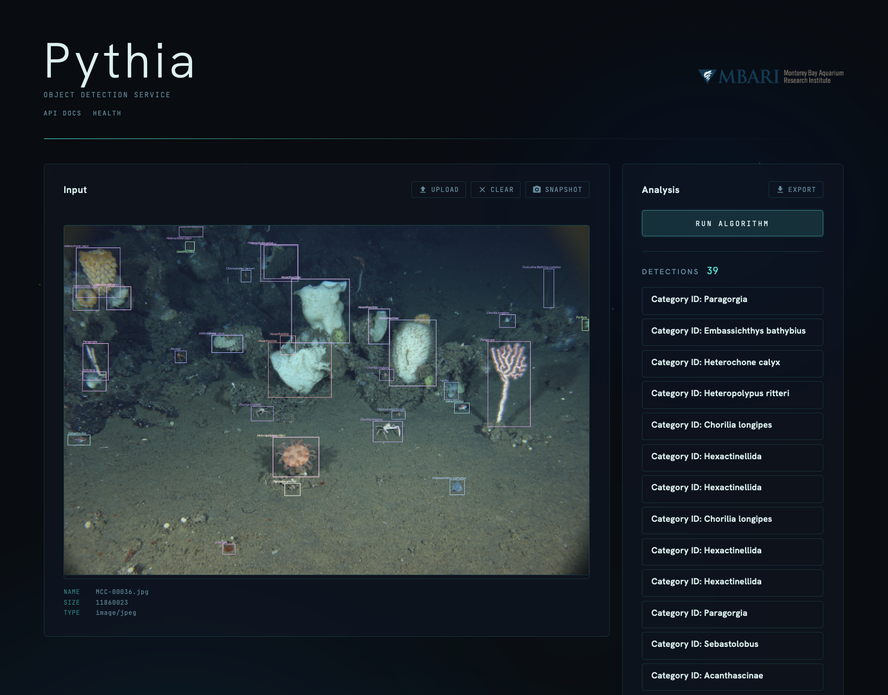

# Pythia (Python)

A Python version of [Pythia](https://github.com/mbari-org/pythia) using FastAPI and Ultralytics. This web service runs YOLO object detection predictions on images.



## Features

- REST API compatible with the Java version of Pythia
- Web UI for uploading images and viewing detection results
- Supports a side variety of [visual models](https://docs.ultralytics.com/models/).
- Swagger/OpenAPI documentation at `/docs`
- Health check endpoint at `/q/health`

## Quickstart

You will need to have your trained model weights (.pt file). In the examples below, we are using `my_model.pt` but you can substitute whatever your one model name.

### Run using docker (no-install)

```sh
docker run -d --name pythia-python \
    --restart always \
    -p 8080:8080 \
    -v "/path/to/models:/models" \
    mbari/pythia-python "/models/my_model.pt"
```

### Run using docker (from repo)

```sh
git clone git@github.com:mbari-org/pythia-python.git
cd pythia-python
just run-docker /path/to/models/my_model.pt
```

## Installation

```bash
# Create virtual environment
python -m venv venv
source venv/bin/activate  # On Windows: venv\Scripts\activate

# Install dependencies
pip install -r requirements.txt
```

## Usage

```bash
# Run with a YOLO model
python main.py /path/to/your/model.pt

# With custom port and threshold
python main.py /path/to/your/model.pt --port 8080 --threshold 0.25

# Full options
python main.py --help
```

## API Endpoints

### POST /predict
Returns a list of bounding boxes with detection results.

```bash
curl -X POST 'http://localhost:8080/predict' \
    -H "accept: application/json" \
    -F "file=@image.jpg"
```

Response:
```json
[
  {
    "concept": "fish",
    "x": 100.5,
    "y": 200.3,
    "width": 50.0,
    "height": 75.0,
    "probability": 0.95
  }
]
```

### POST /predictor
Returns results in keras-model-server compatible format.

```bash
curl -X POST 'http://localhost:8080/predictor' \
    -H "accept: application/json" \
    -F "file=@image.jpg"
```

Response:
```json
{
  "success": true,
  "predictions": [
    {
      "category_id": "fish",
      "scores": [0.95],
      "bbox": [100.5, 200.3, 150.5, 275.3]
    }
  ]
}
```

### GET /q/health
Health check endpoint.

### GET /docs
Swagger UI documentation.

## Development

### Prerequisites

This project uses [just](https://just.systems) as a command runner. Install it via your package manager:

```bash
# macOS
brew install just

# Linux (cargo)
cargo install just

# Other platforms: https://just.systems/man/en/chapter_4.html
```

### Justfile recipes

| Recipe | Description |
|---|---|
| `just run <model>` | Run the server locally with the given model |
| `just run-docker <model>` | Run in Docker, mounting the model's directory into the container |
| `just build` | Build and push a multi-arch (`linux/amd64`, `linux/arm64`) Docker image to Docker Hub |

#### Run locally

```bash
just run /path/to/your/model.pt
```

This is equivalent to `python main.py /path/to/your/model.pt` and starts the server on port 8080.

#### Run in Docker

```bash
just run-docker /path/to/models/my_model.pt
```

This stops and removes any existing `pythia-python` container, then starts a new one with `--restart always` on port 8080. The model's parent directory is mounted into the container at `/models`.

#### Build and push

```bash
just build
```

Builds the image for both `linux/amd64` and `linux/arm64` using `docker buildx` and pushes to `mbari/pythia-python` on Docker Hub. Requires `docker buildx` and push access to the registry.

### Development mode (auto-reload)

```bash
uvicorn main:app --reload --host 0.0.0.0 --port 8080
```

Note: When running in development mode, the model path must be set by modifying `model_path` directly in the code, as CLI args are not parsed when using uvicorn directly.
